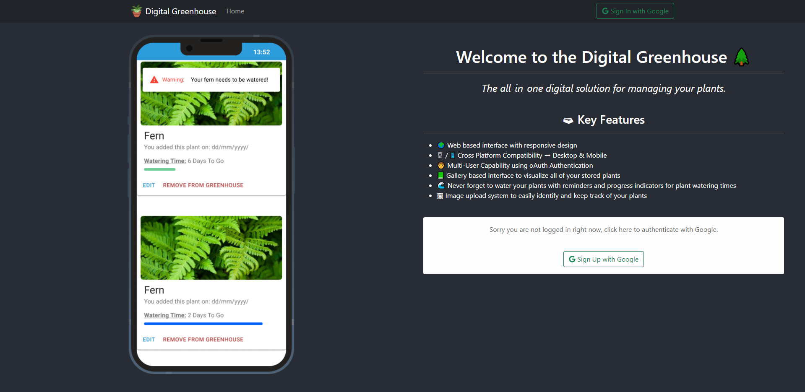

# 💻 IB Computer Science Internal Assessment

> This repository is all of the work I have done for the IB Computer Science Internal Assessment
> The front-end code is deployed from a separate repository that will be linked below.

 a

### 🔥 Live site demo: [https://digital-greenhouse.pages.dev/](https://digital-greenhouse.pages.dev/)

<!--- Once deployed, add in build status for the front and back end --->

### 🧪 [Front-End Code](https://github.com/71xn/ibcs-ia-frontend)

## ✔/❌ Success Criteria

* ✅ 1. Web interface with a modern and responsive design
* ✅ 2. The ability to store a set of plants per user including images and relevant information
* ✅ 2.5. Each unique user that signs into the system has their own database record that stores a list of all of the plants that they have input into the system along with the relevant metadata about said plants/ 
* ✅ 3. The ability to fetch data from the Google Firebase FireStore about plants
  * ✅ 4. The ability to notify users of important information about the plants that they have stored in their “digital greenhouse”; e.g. when to water plants
  * 🔥 4.5 The web-application keeps track of the time till a plant needs to be watered, and then when the user logs into the site, they are presented with a popup notification in a notification panel that alerts them.
* ✅ 5. A gallery based user interface that displays images of plants and their names below with important information; how long to water etc.
* ✅ 5.5 This galley interface will display all of the plants, along with an image, date added to the system and a countdown progress bar indicating the time till the plant needs to be watered.
* ✅ 6. Cross Platform Compatibility → Chrome Desktop and Mobile
* ✅ 7. Multi-user capability using oAuth

## 📃 Testing Plan
<!-- Use shields for each of the tests to show if passed or failed -->
> Coming soon ....

## 🗃 Tech Stack

### ⛰ Frontend (Javascript)

- React.js - UI
- Recoil.js - Global State Management
- Material UI / React Bootstrap - User Interface Components

### 🔥 Backend

- Google Firebase - Authentication and User Data Storage

## License

This project is distributed under the [MIT License](https://github.com/71xn/ibcs-internal-assessment/blob/main/LICENSE), plagiarism of any kind is not permitted.
